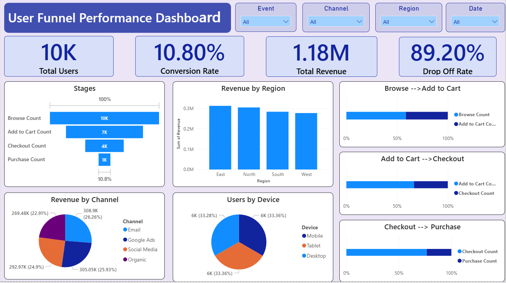
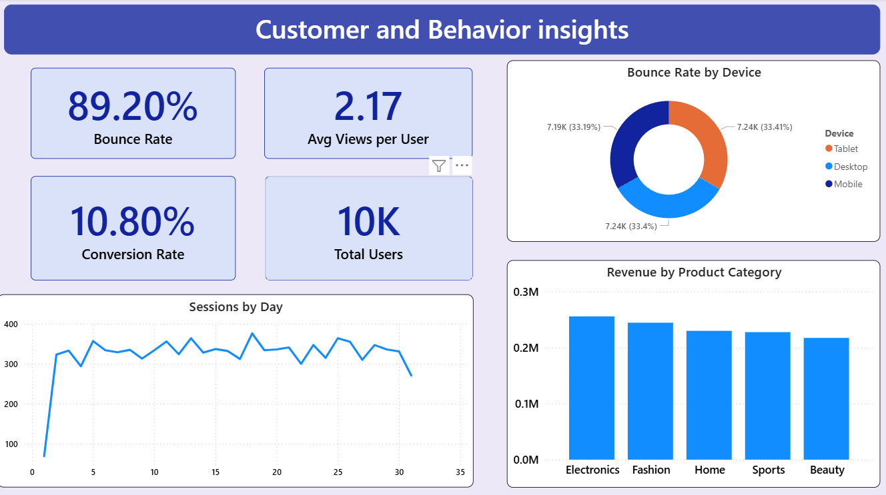
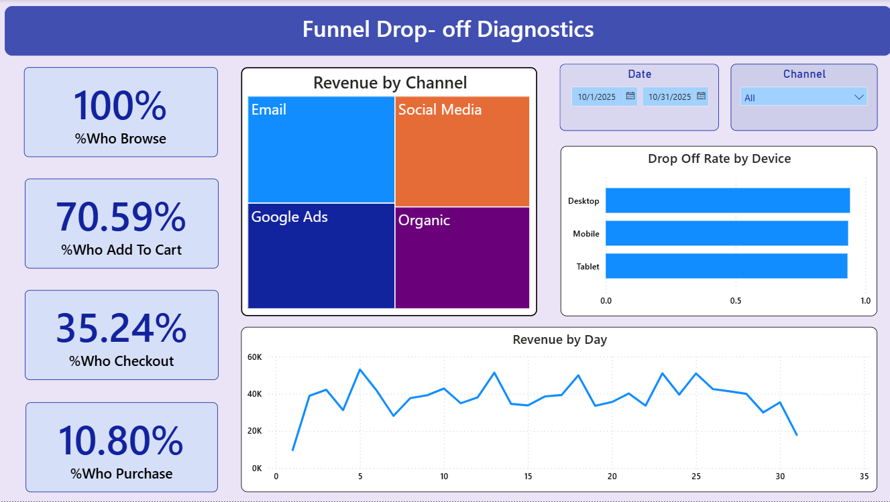

# E-commerce Conversion Funnel Analysis
## Overview

This project analyzes customer behavior in an e-commerce funnel using Python and Power BI to identify drop-offs, conversion rates, and revenue insights.

## Funnel Flow:
Browse → Add to Cart → Checkout → Purchase

## Key Metrics
- Conversion Rate = Purchases / Total Sessions
- Drop-Off Rate = Loss between funnel stages
- Bounce Rate = Bounce Sessions / Total Sessions

## Tools Used
- Python (Pandas, NumPy, Plotly, Matplotlib)
- Power BI (DAX, Dashboards)
- Excel

## Key Insights
- Highest drop-off at Checkout → Purchase stage
- Email & Google Ads performed best in revenue
- Mobile and Desktop usage nearly equal
- East region generated highest revenue

## Dashboard

